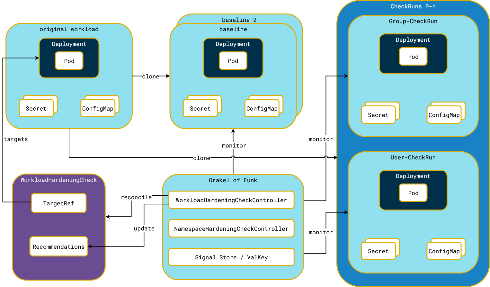
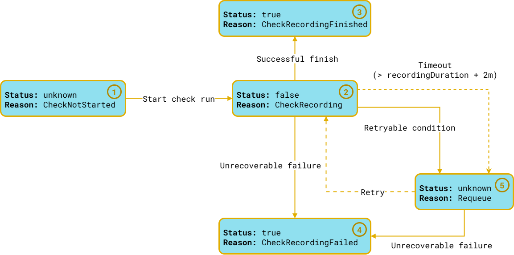

# Orakel of Funk

<h1 align="left" style="border-bottom: none">
    
</h1>


Keep your Kubernetes workloads in tune — secure and functional.

**WIP: This project is part of a Bachelor thesis at FHNW called _Automated Kubernetes Workload hardening using a Functionality Oracle_.**

## What is the Orakel of Funk?

The Orakel of Funk automates the testing and validation of Kubernetes workload hardening through controlled runtime experiments. 
It supports both namespace-wide and workload-specific hardening tests, leveraging Kubernetes-native `securityContext` fields such as `runAsNonRoot`, `readOnlyRootFilesystem`, `seccompProfile`.

When a user creates a `WorkloadHardeningCheck` or `NamespaceHardeningCheck` resource, the operator:

- Clones the target namespace (excluding network resources like Ingress).
- Gathers baseline logs and metrics over a configurable `recordingDuration`.
- Iteratively applies individual runtime restrictions to cloned workloads, isolating the impact of each `securityContext` attribute.
- Compares the behavior of each modified workload against the baseline, producing recommended `securityContext` configuration for each `WorkloadHardeningCheck`.
- In case of a `NamespaceHardeningCheck` the recommendations are propagted to the resources, and a final check run is performed where each workload is hardened according to its recommendations.

This approach allows developers and operators to assess the impact of runtime hardening on their workloads in a systematic, reproducible and automated manner, enabling safer adoption of security best practices without introducing disruptions.

## Getting Started

To install the Operator in your cluster a Helm chart is provided, which deploys the operator and a ValKey instance to your cluster.

To generate the Certificates used by the webhooks, the helm chart relies on `cert-manager`, and assumes it is already present in the cluster. If you do not have `cert-manager` installed, check-out the [cert-manager documentation](https://cert-manager.io/docs/installation/) for installation instructions.

## Installation

The Helm chart is available from the Github package registry: [Orakel of Funk Helm Chart](https://github.com/fhnw-imvs/fhnw-kubeseccontext/pkgs/container/fhnw-kubeseccontext%2Forakel-of-funk)

**Since this is an OCI registry, you need to have at least Helm 3.8.0**

To install the chart, you can use the following command:
```
helm install orakel-of-funk oci://ghcr.io/fhnw-imvs/fhnw-kubeseccontext/orakel-of-funk:0.1.0
```

As long as the repository and packages repository are private, you will need to use a personal access token with the `read:packages` scope to authenticate to the registry. You can do this by running the following command:
```
helm registry login ghcr.io -u <your-username>
```

Since the container image is also hosted on the same registry, you can use the same credentials to pull the image used by the operator, but need to create the ImagePullSecret manually, as the intention is to make both the chart and the image available to the public.

Just make sure to set the `imagePullSecrets` in the `global` section of the values file, or use the `--set global.imagePullSecrets[0].name=<your-secret-name>` flag when installing the chart.

##  Usage

To use the operator, you need to create a `WorkloadHardeningCheck` or `NamespaceHardeningCheck` resource. 

### WorkloadHardeningCheck

This resource targets a single workload (currently Deployment, StatefulSet or DaemonSet) and applies the hardening checks to it. The operator will clone the workload and apply the hardening checks to the cloned workload.

An example of a `WorkloadHardeningCheck` resource is shown below:

```yaml
apiVersion: checks.funk.fhnw.ch/v1alpha1
kind: WorkloadHardeningCheck
metadata:
  name: write-fs-emptydir
  namespace: oof-write-fs-emptydir
  labels:
    app.kubernetes.io/part-of: orakel-of-funk
    app.kubernetes.io/component: test
spec:
  targetRef:
    apiVersion: apps/v1
    kind: Deployment
    name: write-fs-emptydir
  recordingDuration: 1m
```

Since this resource is namsepace-scoped, it will assume that the target workload is in the same namespace as the `WorkloadHardeningCheck` resource. The operator will clone the workload and apply the hardening checks to the cloned workload.


### NamespaceHardeningCheck

This resource targets a whole namespace and applies the hardening checks to all workloads in the namespace.

An example of a `NamespaceHardeningCheck` resource is shown below:

```yaml
apiVersion: checks.funk.fhnw.ch/v1alpha1
kind: NamespaceHardeningCheck
metadata:
  labels:
    app.kubernetes.io/name: orakel-of-funk
  name: podtato-namespace-hardening
spec:
  targetNamespace: podtato-kubectl
  recordingDuration: 1m
```

The resource is cluster-scoped, and will create `WorkloadHardeningCheck` resources for each workload in the `targetNamespace`.

## Example Workloads

To test the operator, multiple example workloads are provided in the `examples` directory. These workloads can be used to test the operator and see how it works.

### Podtato App

The [Podtato-Head](https://github.com/podtato-head/podtato-head) is a Demo App by the TAG App Delivery. It consists of multiple microservices, running in a single namespace.

This example contains a `NamespaceHardeningCheck` resource that targets the `podtato-kubectl` namespace.

### MariaDB

The MariaDB example contains rendered manifests, based on the MariaDB Helm chart using the default `values.yaml`.

It contains a `WorkloadHardeningCheck` resource that targets the `mariadb` deployment in the `mariadb` namespace.

### Nginx based workloads

There are multiple examples based on simple Nginx containers. They are intended to show how different configurations of a workload can affect the hardening checks and the recommendations made by the operator.

### Custom Workloads

Last but not least, there are a few custom workloads, based on simple bash scripts to test specific scenarios/`securityContext` configurations. These are intended to verify the operator's behavior in specific scenarios, such as:

- A workload that tries to write to the container filesystem.
- The same workload, but adapted to use an `emptyDir` volume.
- A workload trying to `chown` a file to a different user. This requires the `chown` capability to be set in the `securityContext`.
- A workload trying to escalate his privileges.


## Development

This Operator is developed in Go, using the Operator SDK. The code is structured in a way that allows for easy testing and development.

### Architecture

<h1 align="center" style="border-bottom: none">
    
</h1>

The operator is structured around the `Controller` pattern, where each controller is responsible for a specific resource type. The two main controllers are:

- `WorkloadHardeningCheckController`: Responsible for handling `WorkloadHardeningCheck` resources.
- `NamespaceHardeningCheckController`: Responsible for handling `NamespaceHardeningCheck` resources.

In addition both CRDs also have mutating and validating webhooks, which are used to validate the resources and mutate them before they are created.

### Webhooks

The mutating webhooks, only add a `suffix` to both the `WorkloadHardeningCheck` and `NamespaceHardeningCheck` resources, if none is provided.
This suffix is used to create a unique name for the cloned namespaces, so that it does not conflict with the original workload.
In case of the `NamespaceHardeningCheck` the suffix is also used to create extended suffixes for the `WorkloadHardeningCheck` resources.

The validating webhook for the `NamespaceHardeningCheck` ensures that the `targetNamespace` exists, but does not check if the namespace is empty. 

The validating webhook for the `WorkloadHardeningCheck` ensures that the `targetRef` points to an existing workload, which is in the `ready` state. If you apply the `WorkloadHardeningCheck` at the same time as your workload, the webhook will not be able to find the workload, and will reject the request. In this case you need to wait until the workload is in the `ready` state and apply it again.

### CheckRuns / Types

To run checks a `CheckRunner` is used, which is responsible for running the checks and collecting the results. The `CheckRunner` is implemented in `internal/runner/runners.go`.

The available checks are implemented based on the `CheckInterface` in `pkg/checks/check.go`, and new checks can be added by implementing this interface. They need to register themselves using the `RegisterCheck` function in `pkg/checks`.

The `CheckInterface`, which defines two methods: 
1. `ShouldRun` to check if the `podSpec` does not yet define the necessary `securityContext` attributes
1. `GetSecurityContextDefaults` to apply the `securityContext` required for the specific check.

The `CheckRunner` will then run the checks and collect the results into a `recording.WorkloadRecording` struct, which is serialized and stored in ValKey.
To track the progress of each check, the `CheckRunner` creates a `status.Condition` for each check, which is updated as the check progresses.

<h1 align="center" style="border-bottom: none">
    
</h1>

### Recording signals

The `CheckRunner` uses a `Recorder` per signal. Those are implement in `internal/recording/` and explicitly called in the `CheckRunner`.

Some signals are only recorded if the pod reaches the `ready` state, while others are recorded regardless of the pod state. The `Recorder` is responsible for deciding which signals to record based on the pod state and the signal type.

### Functionality Oracles

There are two independent oracles implemented in the operator, which are used to compare the behavior of the workloads:

1. `LogOrakel`: This oracle analyzes the logs of the recorded baselines and compares them to logs of the `checkRuns`. The oracle is based on the [Drain3](https://github.com/logpai/Drain3) algorithm as implemented by [faceair/drain](https://github.com/faceair/drain). Logs that are not present in the baseline, are considered anomalies, thus indicating a change in the workload's behavior. If any anomalies are detected, the oracle will mark the check as failed, and store the detected anomalies in the `CheckRun` status.
1. `MetricsOrakel`: This oracle analyzes the metrics of the recorded baselines and compares them to metrics of the `checkRuns`. The oracle calculates the mean and standard deviation of the metrics and compares them to the baseline. If the metric is outside of the range of the baselines, it is considered a deviation and flagged on the `checkRun`.

The oracles are implement in `pkg/orakel/` from where they can be included into other golang projects as well.